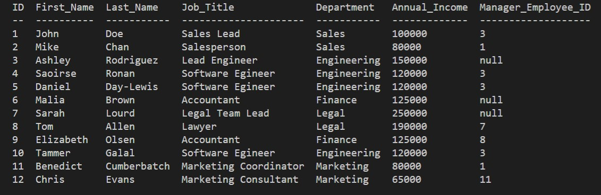

# Employee Tracker Tool

Hello! This is my Employee Tracker tool. It helps organize a staff roster and includes the employee's name, role, department, salary, and manager's employee ID. It also allows the user to update the roles of the existing employees as well as add new 
departments, and new employees. This tool primarily made up of MySQL2, JavaScript, and Node. 

## Video Demo
https://drive.google.com/file/d/1TRfrG3pZG8Nxo3d84CFZKX6mFC_Cfd9o/view

## Table of Employees

## Github Repo Link
https://github.com/josephprospero/employee-tracker/tree/main
